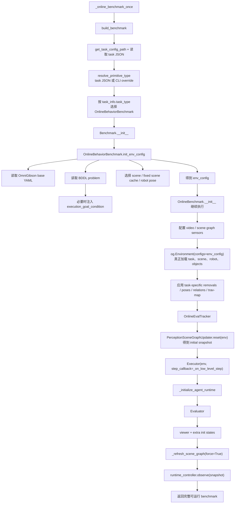
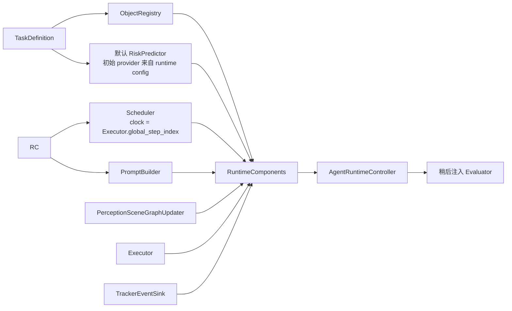
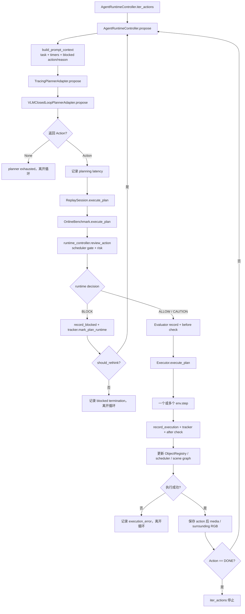
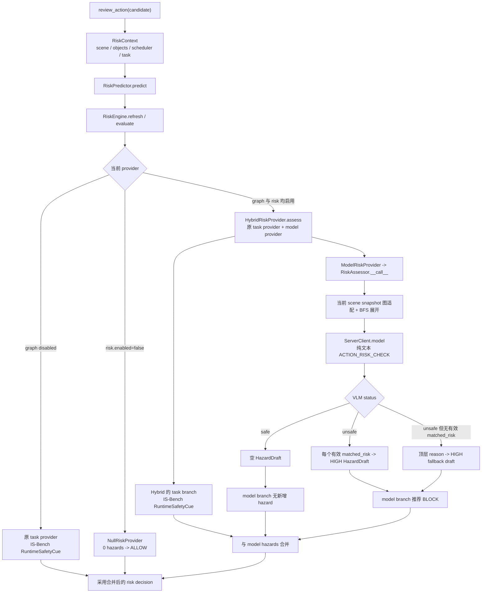
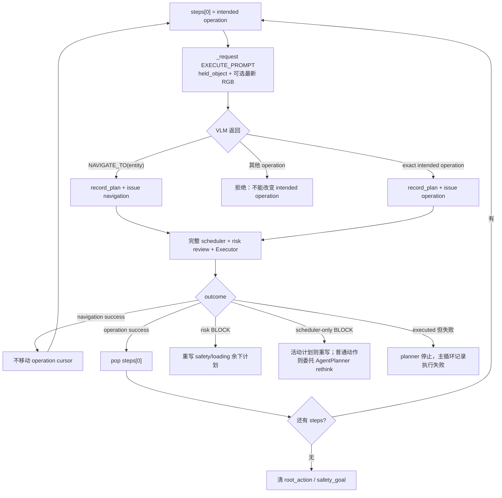
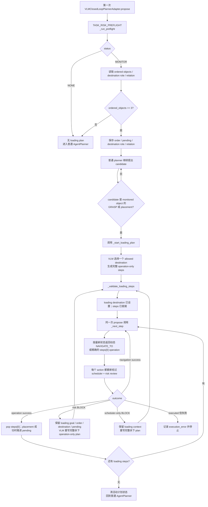
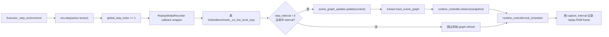
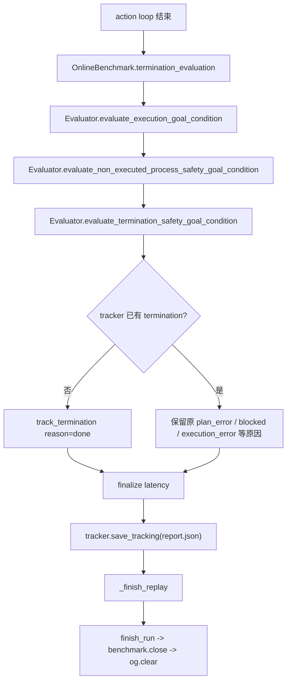

# Online Benchmark 完整加载与执行流程

本文静态追踪当前 `og_ego_prim/cli/online_benchmark_once.py` 从进程入口、任务与场景加载、运行时组件构造、VLM 规划与风险闭环，到最终评测、报告、Replay 和清理的完整调用链。

本文只描述当前代码真实发生的事情。最重要的时序约束是：

> `OnlineBenchmark` 及其 `env / Executor / scene graph / ObjectRegistry / scheduler / risk predictor / evaluator / runtime controller` 会先完成构造；之后 CLI 才创建 `AgentPlanner` 并绑定 `VLMClosedLoopPlannerAdapter`。只有 scene graph 启用且 `risk.enabled=true` 时，CLI 才将原 task provider 与 `ModelRiskProvider` 组合为 `HybridRiskProvider`。不能画成“模型先产生动作，再构造 OnlineBenchmark”。

主要入口与实现位置：

- 进程入口与主循环：`og_ego_prim/cli/online_benchmark_once.py::_apply_config()`、`::_online_benchmark_once()`、`::online_benchmark_once()`、`::__main__`
- benchmark 工厂：`og_ego_prim/benchmark/__init__.py::build_benchmark()`
- benchmark 初始化与动作执行：`og_ego_prim/benchmark/online_benchmark.py::OnlineBenchmark.__init__()`、`::OnlineBenchmark.execute_plan()`
- 运行时控制器：`og_ego_prim/agent_runtime/controller.py::AgentRuntimeController`
- 普通模型 planner：`og_ego_prim/task_planner/planner.py::AgentPlanner`
- VLM 闭环 adapter：`og_ego_prim/task_planner/adapters.py::VLMClosedLoopPlannerAdapter`
- VLM 风险评估：`og_ego_prim/risk_predictor/risk_assessor.py::RiskAssessor`
- 高层 primitive 执行器：`og_ego_prim/primitives/executor.py::Executor`

## 1. 总体时序

```text
python -m og_ego_prim.cli.online_benchmark_once
|
|-- 切换到 OmniGibson Python（必要时重启当前进程）
|-- 安装 monkey patch
|-- 解析 CLI 参数
|-- 加载 RuntimeConfig YAML，并用 CLI 显式参数覆盖默认值
|-- 校验 task / scene
|
`-- online_benchmark_once()                         [外层生命周期保护]
    |
    `-- _online_benchmark_once()
        |
        |-- build_benchmark()
        |   |
        |   |-- 读取 task JSON
        |   |-- 解析 primitive_type
        |   |-- 构造 OnlineBehaviorBenchmark
        |   |   |
        |   |   |-- 读取 OmniGibson base YAML + BDDL + scene cache
        |   |   |-- 构造 og.Environment，加载 task / scene / robot / objects
        |   |   |-- 构造 tracker、scene graph updater、Executor
        |   |   |-- 构造 ObjectRegistry、scheduler、默认 risk predictor
        |   |   |-- 构造 AgentRuntimeController 和 Evaluator
        |   |   `-- 强制刷新 scene graph，并送入 runtime controller
        |   `-- 返回已经可执行的 benchmark
        |
        |-- 分配 output_dir
        |-- 挂载 ReplaySession / evaluator trace / executor trace / media trace
        |-- 创建 AgentPlanner + ServerClient
        |-- scene graph 与 risk 均启用时，安装 ModelRiskProvider(RiskAssessor)
        |-- 创建并绑定 VLMClosedLoopPlannerAdapter
        |-- 可选保存初始 RGB / caption / awareness
        |
        |-- for action in runtime_controller.iter_actions():
        |   |-- 构造 PromptContext
        |   |-- planner / safety / loading 产生一个 Action
        |   |-- scheduler gate + VLM risk review
        |   |-- BLOCK: 不执行，进入 rethink 或终止
        |   `-- ALLOW/CAUTION: Evaluator(before) -> Executor -> env.step
        |       -> ObjectRegistry/scheduler/scene graph/evaluator(after)/tracker 回写
        |
        |-- termination_evaluation()
        |-- 保存 report.json
        |-- 保存 Replay 视频、事件与 manifest
        `-- close benchmark / clear simulator
```

## 2. 初始化与组件所有权

### 2.1 入口、参数与 RuntimeConfig

入口文件在导入 OmniGibson 主模块前先执行运行环境准备：

1. `maybe_reexec_with_omnigibson_python()`：`og_ego_prim/cli/online_benchmark_once.py` 的模块导入初始化。
2. `add_monkey_patch()`：`og_ego_prim/cli/online_benchmark_once.py` 的模块导入初始化。
3. 创建 argparse 参数：`og_ego_prim/cli/online_benchmark_once.py::parser`。
4. `__main__` 调用 `_apply_config()`：`og_ego_prim/cli/online_benchmark_once.py::__main__`。
5. `_apply_config()` 调用 `load_runtime_config_dict()`，再构造 `RuntimeConfig`：`og_ego_prim/cli/online_benchmark_once.py::_apply_config()`。

`load_runtime_config_dict()` 位于 `og_ego_prim/config/runtime_config.py::load_runtime_config_dict()`，它先生成完整默认配置，再递归合并 YAML `includes`。CLI 参数只有在值为 `None` 时才采用 YAML 中的 task、scene、model、primitive、scene graph 等默认值；显式 CLI 参数优先。

### 2.2 Benchmark 构造顺序



`OnlineBehaviorBenchmark.init_env_config()` 的关键工作位于 `og_ego_prim/benchmark/online_benchmark.py::OnlineBehaviorBenchmark.init_env_config()`：

- 从任务 JSON 的 `_base_config` 读取 OmniGibson 环境 YAML。
- 确定 BDDL activity、definition id 和 instance id。
- 若 task JSON 提供 `evaluation_goal_conditions.execution_goal_condition`，调用 `inject_execution_goal_into_bddl_problem()` 在内存中替换 BDDL goal；实现位于 `og_ego_prim/config/task_definition.py::inject_execution_goal_into_bddl_problem()`。
- 选择 `BehaviorTask` 或在线采样用 `CustomBehaviorTask`。
- 校验 scene 是否在任务允许集合内。
- 若固定 scene cache 存在，将其写入 `env_config['scene']['scene_file']`。

随后 `OnlineBenchmark.__init__()` 在 `og_ego_prim/benchmark/online_benchmark.py::OnlineBenchmark.__init__()` 中创建环境和全部运行时组件。`og.Environment(...)` 也由该方法构造，因此 task、scene、robot、objects 在 planner 创建之前已经加载完成。

### 2.3 task JSON 的三种投影

`_initialize_agent_runtime()` 调用 `load_task_definition(config)`，将同一 task JSON 分离为三类视图：

```text
TaskDefinition
|
|-- agent: AgentTaskView                   [仅允许进入 planner]
|   |-- instruction
|   |-- plain-text goal_description
|   |-- initial_setup
|   |-- object_ids / object_abilities
|   `-- wash_rules / subtasks / examples
|
|-- runtime: RuntimeTaskConfig             [供 runtime risk 默认规则使用]
|   `-- action-scoped safety_cues
|
`-- evaluation: EvalTaskConfig             [仅供 Evaluator]
    |-- execution goal BDDL
    |-- process safety BDDL
    |-- termination safety BDDL
    `-- evaluation cautions
```

对应实现：

- `TaskDefinition`：`og_ego_prim/config/task_definition.py::TaskDefinition`
- `build_agent_task_view()`：`og_ego_prim/config/task_definition.py::build_agent_task_view()`
- `build_runtime_task_config()`：`og_ego_prim/config/runtime_config.py::build_runtime_task_config()`
- `build_eval_task_config()`：`og_ego_prim/config/eval_config.py::build_eval_task_config()`

Evaluator 的 BDDL oracle 不会进入 `AgentTaskView` 或 planner prompt。

### 2.4 RuntimeComponents 构造

`OnlineBenchmark._initialize_agent_runtime()` 位于 `og_ego_prim/benchmark/online_benchmark.py::OnlineBenchmark._initialize_agent_runtime()`：



`RuntimeComponents` 只是依赖容器，定义在 `og_ego_prim/agent_runtime/components.py::RuntimeComponents`。真正的跨模块编排由 `AgentRuntimeController` 负责。

### 2.5 所有权树

```text
online_benchmark_once CLI
|
|-- run lifecycle
|-- output_dir
|-- ReplaySession / ReplayMediaRecorder
|-- AgentPlanner 创建与模型 client trace
`-- 顶层 for-action 循环

OnlineBenchmark
|
|-- env: og.Environment
|-- executor: Executor
|-- tracker: OnlineEvalTracker
|-- evaluator: Evaluator 或 TracingEvaluatorProxy
|-- scene_graph_updater: PerceptionSceneGraphUpdater
`-- runtime_controller: AgentRuntimeController
    |
    |-- latest_scene / latest_changes / visible_entity_ids
    |-- last_review / last_outcome / rethinking_attempts
    |-- PlannerEpisode
    `-- RuntimeComponents 引用
        |-- perception -> scene_graph_updater
        |-- objects -> ObjectRegistry
        |-- scheduler -> Scheduler
        |-- prompt_builder -> PromptBuilder
        |-- risk_predictor -> RiskPredictor
        |   `-- provider
        |       |-- risk 关闭 -> NullRiskProvider
        |       |-- graph 关闭 -> 原 task provider
        |       `-- graph 与 risk 均启用 -> HybridRiskProvider
        |           |-- 原 task provider -> IS-Bench RuntimeSafetyCue
        |           `-- ModelRiskProvider -> RiskAssessor
        |-- planner -> TracingPlannerAdapter
        |   `-- VLMClosedLoopPlannerAdapter
        |       |-- base -> AgentPlannerAdapter -> AgentPlanner
        |       `-- 临时闭环状态: preflight/loading/root/goal/steps/inflight
        |-- executor -> 同一个 OnlineBenchmark.executor
        |-- evaluator -> 同一个 OnlineBenchmark.evaluator
        `-- event_sink -> ReplaySession + TrackerEventSink
```

需要特别区分两个 controller：

- `OnlineBenchmark.runtime_controller` 是 `AgentRuntimeController`，负责模块编排和 action review。
- `OnlineBenchmark.executor.controller` 是具体 primitive controller，负责把高层 primitive 转成低层 robot action tensor。

### 2.6 Replay 和模型组件后绑定

benchmark 返回后，CLI 才执行以下步骤：

1. `_allocate_output_dir()`：`og_ego_prim/cli/online_benchmark_once.py::_allocate_output_dir()`。
2. `_attach_replay_session()`：`og_ego_prim/cli/online_benchmark_once.py::_attach_replay_session()`。
3. 创建 `AgentPlanner`：`og_ego_prim/cli/online_benchmark_once.py::_online_benchmark_once()` 的 model 分支。
4. 将 `AgentPlanner.client` 包成 `TracingModelClient`。
5. scene graph updater 非 disabled 时调用 `og_ego_prim/risk_predictor/utils.py::install_vlm_risk_provider()`；该函数还会检查 `risk.enabled`。两个条件都满足时，它取得现有 risk predictor，并将原 task provider 与 `ModelRiskProvider(RiskAssessor(...))` 组合成 `HybridRiskProvider`。因此 VLM 的 `safe` 分支返回空 model hazards，但不会丢掉 IS-Bench 自己的 `RuntimeSafetyCue`。若 `risk.enabled=false`，则保留 `NullRiskProvider`；若仅 graph disabled，则保留原 task provider。
6. 创建 `VLMClosedLoopPlannerAdapter`，再包成 `TracingPlannerAdapter`。
7. `benchmark.bind_planner_adapter()` 将 adapter 写入 `runtime_controller.components.planner`；调用链为 `OnlineBenchmark.bind_planner_adapter()` -> `AgentRuntimeController.bind_planner()`。

Replay 的角色是观察当前真实执行，而不是重放历史动作：

- 组合 controller event sink。
- 包装 `Executor.execute_plan()` 记录 primitive 开始/结束/异常。
- 包装 Evaluator 方法记录评测事件。
- 包装 low-level `step_callback` 连续采集 camera frame。
- 不主动调用历史 action，也不改变 planner 的 action 顺序。

## 3. 逐 Action 闭环

### 3.1 主循环总图



CLI 在 `og_ego_prim/cli/online_benchmark_once.py::_online_benchmark_once()` 中先取得 `runtime_controller.iter_actions()`，再用 `track_planning_latency()` 包装 generator。计时器测量每一次 `next(planner)`，因此包括普通 planning、preflight、safety plan 和 operation preparation 的模型调用。

### 3.2 PromptContext 的生成

`AgentRuntimeController.propose()` 位于 `og_ego_prim/agent_runtime/controller.py::AgentRuntimeController.propose()`。它先判断上一动作是否满足：

```text
last_outcome 存在
AND last_outcome.executed == False
AND last_review 存在
AND last_review.should_rethink == True
```

满足时，本轮 `PromptContext` 包含上一被阻止的 `candidate_action` 和 `rethinking_reason`；否则是普通 planning context。

`build_prompt_context()` 位于 `og_ego_prim/agent_runtime/controller.py::AgentRuntimeController.build_prompt_context()`，内容包括：

| 字段 | 来源 |
|---|---|
| `task_instruction` | 当前 `AgentTaskView` 或 active subtask |
| `pending_timers` | Scheduler 当前可见 pending process |
| `candidate_action` | 上一被阻止的 action，普通轮为 `None` |
| `allowed_actions` | 当前 Executor `valid_primitives` 的动作名 |
| `rethinking_reason` | scheduler/risk review 合成原因 |
| `section_data.goal_description` | planner-facing 纯文本 goal |

Scene graph 和 ObjectRegistry 不写入 planner 的 `PromptContext`；scene graph 只通过 `RiskContext.scene` 交给 risk predictor。

### 3.3 普通 AgentPlanner 路径

当 adapter 没有需要执行的 loading/safety steps 时，调用 `og_ego_prim/task_planner/adapters.py::AgentPlannerAdapter.propose()`。它惰性创建并推进 `AgentPlanner.step()` generator。

`AgentPlanner.step()` 位于 `og_ego_prim/task_planner/planner.py::AgentPlanner.step()`：

```text
读取上一成功执行 action 和对应 RGB
|
|-- AgentPlanner._get_last_execution_info()
|   `-- observation_dir = 当前 output_dir
|
|-- AgentPlanner._prepare_prompt()
|   |-- task instruction / objects / abilities / goal
|   `-- runtime planning_prompt 或 pending rethinking_prompt
|
|-- ServerClient.model(prompt, image_file=obs)
|-- parse_json_code_block()
|-- _verify_plan()
|   |-- action 必须属于 get_valid_primitives(primitive_type)
|   |-- 参数数量必须匹配当前 primitive arity
|   |-- 普通 AgentPlanner 通过 objects_str 检查 entity 文本
|   `-- starter 必要时先改写为 NAVIGATE_TO(destination)
|
|-- AgentPlanner.record_plan()
|   |-- current_step += 1
|   |-- tracker.track_plan
|   `-- tracker.track_raw_output
`-- yield 一个 Action
```

闭环 adapter 自己产生的动态 navigation、safety 和 loading action 也会经 `AgentPlanner.record_plan()` 计入同一个 `current_step` 和 action budget。

普通 `AgentPlanner._verify_plan()` 沿用已有的 `obj in self.objects_str` 检查；闭环 adapter 的专用 JSON 请求则调用 `og_ego_prim/utils/planning.py::validate_planner_action()`，对 `allowed_entity_ids` 做精确成员检查。

#### 动作词表与外部动作迁移边界

外部 `prompts/plan.txt` 的 16 个 operation 是：

```text
NAVIGATE_TO, OPEN, CLOSE, CUT, FILL_WITH, PICK,
WAIT_FOR_COOKED, WAIT_FOR_WASHED,
PLACE_INSIDE, PLACE_ON_TOP, PLACE_AWAY,
SOAK_UNDER, SOAK_INSIDE, TOGGLE_ON, TOGGLE_OFF, WIPE
```

`DONE` 在外部协议和当前闭环中都是终止 status，不属于 operation-only safety/loading plan。当前项目的完整原语词表来自 `get_valid_primitives(primitive_type)`：

| primitive type | 当前有效动作 |
|---|---|
| ego | `NAVIGATE_TO, GRASP, RELEASE, PLACE_ON_TOP, PLACE_INSIDE, PLACE_NEXTTO, OPEN, CLOSE, TOGGLE_ON, TOGGLE_OFF, WIPE, CUT, SOAK_INSIDE, SOAK_UNDER, FILL_WITH, POUR_INTO, SPREAD, WAIT, WAIT_FOR_COOKED, WAIT_FOR_WASHED, WAIT_FOR_FROZEN, MARK_WET_REGION` |
| starter | `GRASP, PLACE_ON_TOP, PLACE_INSIDE, POUR_INTO, DUMP_INTO, OPEN, CLOSE, NAVIGATE_TO, RELEASE, TOGGLE_ON, TOGGLE_OFF, WIPE, WAIT, WAIT_FOR_COOKED, WAIT_FOR_WASHED, WAIT_FOR_FROZEN` |
| symbolic | `GRASP, PLACE_ON_TOP, PLACE_INSIDE, OPEN, CLOSE, TOGGLE_ON, TOGGLE_OFF, SOAK_UNDER, SOAK_INSIDE, WIPE, CUT, PLACE_NEAR_HEATING_ELEMENT, NAVIGATE_TO, RELEASE, WAIT, WAIT_FOR_COOKED, WAIT_FOR_WASHED, WAIT_FOR_FROZEN` |

迁移规则如下。它们只说明语义对应关系，不构成新的 runtime translator；VLM 每次只能输出当前 primitive type 已有的动作和元数。

| 外部动作 | 当前项目处理 |
|---|---|
| `PICK(X)` | 使用 `GRASP(X)`。 |
| `PLACE_INSIDE/PLACE_ON_TOP(X,D)` | ego 保持双参数；starter/symbolic 使用现有“先 `GRASP(X)`、按需 `NAVIGATE_TO(D)`、再单参数 placement/release”语法。 |
| `CUT(X,T)` | ego 可直接使用双参数；symbolic 使用已有单参数 `CUT`；starter 没有该原语，不新增翻译层。 |
| `FILL_WITH(X,S)` | ego 可直接使用；starter 仅在语义确实适用时由 VLM 从已有 `POUR_INTO/DUMP_INTO` 中选择，不硬编码替换。 |
| `WIPE(X,T)` | ego 使用双参数；starter/symbolic 由完整计划先抓取工具并导航，再输出当前单参数 `WIPE(T)`。 |
| `SOAK_UNDER/SOAK_INSIDE` | 不迁入新实现；ego/symbolic 可继续使用项目已有能力，starter 保持 TODO。 |
| `PLACE_AWAY` | 当前词表没有，保持 TODO，不让 VLM 输出。 |
| 其余同名动作 | 仅在当前 primitive set 存在时原样使用。 |

### 3.4 ActionReview：scheduler 与 risk 的合成

`OnlineBenchmark._execute_plan()` 先调用 `_runtime_action()`，再进入 `AgentRuntimeController.review_action()`：

- `_runtime_action()`：`og_ego_prim/benchmark/online_benchmark.py::OnlineBenchmark._runtime_action()`
- `review_action()`：`og_ego_prim/agent_runtime/controller.py::AgentRuntimeController.review_action()`

starter 的 `PLACE_* / POUR_INTO / RELEASE` 在 executor 语法中可能隐式使用当前手持物。`_runtime_action()` 只为 risk review、object model 和 scene graph manipulation update 构造显式 `object_id + target_id`，并将原始 executor 参数保存在 `parameters['executor_arguments']`；它不会给公共 `Action` 或 `StateChange` 新增 `held_object` 字段。

Review 顺序：

```text
candidate Action
|
|-- tick_scheduler()
|-- scheduler.check_action()
|   `-- TemporalGate: ALLOW 或 BLOCK
|
|-- risk_predictor.predict(action, RiskContext)
|   `-- RiskEvaluation: ALLOW / CAUTION / BLOCK
|
|-- 合成最终 decision
|   |-- scheduler 不允许 OR risk == BLOCK  => BLOCK
|   |-- 否则 risk == CAUTION               => CAUTION
|   `-- 否则                               => ALLOW
|
|-- 若 BLOCK 且 planner.supports_rethinking
|   且 rethinking_attempts < max_rethinking_attempts
|   `-- should_rethink = True
|
`-- 写 PlannerEpisodeEntry 和 last_review
```

当前 `AgentRuntimeController.__init__()` 的默认 `max_rethinking_attempts=3`，见 `og_ego_prim/agent_runtime/controller.py::AgentRuntimeController.__init__()`。每次 BLOCK 都增加计数；任一 action 成功后，`record_execution()` 将计数清零。

### 3.5 BLOCK 与执行失败不是同一件事

| 情况 | `outcome.executed` | 是否调用 Executor | 后续 |
|---|---:|---:|---|
| scheduler/risk BLOCK | `False` | 否 | should_rethink 时重新规划，否则终止 |
| primitive 正常成功 | `True` | 是 | 更新 scheduler/ObjectRegistry/scene graph，继续 |
| primitive 抛错或失败 | `True` | 是 | 记 execution error，通常终止 |

BLOCK 路径位于 `og_ego_prim/benchmark/online_benchmark.py::OnlineBenchmark._execute_plan()`：它调用 `AgentRuntimeController.record_blocked()`、更新 tracker 后立即返回 `False`。因此被挡动作不会进入 Evaluator before/after、不会进入 `Executor`、不会调用 `env.step()`，也不会触发 action 后 scene graph refresh。

## 4. VLM Risk Predictor

### 4.1 RiskContext 到 BLOCK



风险层只保留 `risk.enabled` 总开关：启用时按 hazards 直接生成 ALLOW、CAUTION 或 BLOCK；关闭时工厂安装 `NullRiskProvider`，因此没有 hazards 并返回 ALLOW。对 `safe_memory_benchmark_once` 而言，`with_memory` 固定构建 `samjam_unigoal` 并额外安装 scene-graph VLM provider，`without_memory` 固定使用 disabled backend 且不安装该 provider。普通 `online_benchmark_once` 没有 memory mode，而是按实际 scene-graph backend 是否 disabled 决定是否尝试安装。启用 VLM 时，Hybrid 两个分支参与同一次评估：task provider 保留当前 IS-Bench hazard/caution，model provider 执行本文描述的 scene-graph VLM 判断。

### 4.2 当前 scene graph 的展开规则

`RiskAssessor.__call__()` 位于 `og_ego_prim/risk_predictor/risk_assessor.py::RiskAssessor.__call__()`，只消费 `RiskContext.scene` 当前快照，不读取外部 graph-memory JSON。

图处理链：

1. `_scene_payload()`：`og_ego_prim/risk_predictor/risk_assessor.py::_scene_payload()`
   - scene 必须存在且可转成 mapping。
   - 若 snapshot 明确标记 `ready=false`，显式报错。
2. `_index_graph()`：`og_ego_prim/risk_predictor/risk_assessor.py::_index_graph()`
   - 要求存在 usable rooms 和 nodes。
   - 排除结构 membership edge：`in_room`、`in_group`。
   - 拒绝重复 node id、畸形 room/node/edge 和物理关系 dangling endpoint。
   - 保留物理 `in` 关系和其他物理边。
3. `_action_roots()` + `_resolve_entity()`：`og_ego_prim/risk_predictor/risk_assessor.py::_action_roots()`、`::_resolve_entity()`
   - roots 来自 action entities 和 `_current_grasped_object_id()`。
   - entity 完全缺失时显式报错。
   - 不用任务实例尾号猜测感知 UID 尾号；同类多实例全部作为保守 roots，并输出 `task entity -> candidate nodes` 映射。
4. `_format_relation_expansion()`：`og_ego_prim/risk_predictor/risk_assessor.py::_format_relation_expansion()`
   - 从所有 roots 做 multi-source BFS。
   - 先输出 depth 1，再输出更远关系。
   - 遍历时边可双向到达，但展示始终保留原 edge source -> target 方向。
   - 每条边标记 `depth` 和 `expanded from`。
   - 输出遍历 node/edge 总数，确认所有可达物理关系已列出。
5. `_format_scene()`：`og_ego_prim/risk_predictor/risk_assessor.py::_format_scene()`
   - 直接序列化 node 现有 `states` 和 `hazard`。
   - 缺失值写为 `unknown`，不伪造 wetness、contamination 等事实。
   - 不重复输出全图关系；关系只由上面的 depth 排序 BFS 段输出。

RiskAssessor 不使用 `has_position_label`、placement marker，也没有 placement alignment audit。

当前默认配置以及 safe-memory 的 `with_memory` 路径使用 `samjam_unigoal` perception backend。它持续更新同一个 scene graph；当前不可见但此前已观察到的节点仍保留在最新快照中。`without_memory` 固定为 disabled，不构图。本次新增的 risk adapter 只消费 updater 提供的 `RiskContext.scene`，不读取外部 graph-memory JSON，也不直接构造 truth-grounded scene graph。

## 5. Safety Plan 与 Loading 子流程

`alternative replan` 不再有独立响应协议。risk BLOCK 统一进入一次完整 `SAFETY_PLAN` rethink；prompt 会优先考虑同角色安全替代，若不存在再生成其他完整风险化解操作序列。

### 5.1 与用户示意一致的 risk 树

```text
候选动作被 runtime review 判为 BLOCK
|
|-- 仅 scheduler BLOCK
|   |-- 当前没有 safety/loading steps
|   |   `-- 委托原 AgentPlanner rethink
|   |       `-- 使用 runtime_controller.rethinking_prompt()
|   `-- 当前有 safety/loading steps
|       `-- 保留当前目标和上下文，重写完整余下 SAFETY_PLAN
|
`-- risk BLOCK（包括 scheduler + risk 同时 BLOCK）
    |
    |-- 保存 original blocked action 为 root_action
    |-- 一次生成完整 operation-only SAFETY_PLAN
    |   |-- 优先选择同角色安全替代
    |   |-- 不替换任务明确指定的实体
    |   `-- 否则生成完整风险化解操作序列
    |
    `-- safety/loading plan 当前 operation 被 risk BLOCK
        |-- safety: 保留 original goal
        |   `-- 用 failed action + remaining steps 重写完整余下计划
        `-- loading: 保留 loading goal / order / destination / pending
            `-- 重写并重新校验完整余下 loading plan
```

实现集中在：

- `_handle_risk_block()`：`og_ego_prim/task_planner/adapters.py::VLMClosedLoopPlannerAdapter._handle_risk_block()`
- `_safety_plan()`：`og_ego_prim/task_planner/adapters.py::VLMClosedLoopPlannerAdapter._safety_plan()`
- `propose()` 总入口：`og_ego_prim/task_planner/adapters.py::VLMClosedLoopPlannerAdapter.propose()`

### 5.2 Safety / loading plan 的动态导航与 cursor 规则

VLM 返回的 safety plan 和 loading plan 都只允许 operation，不允许直接包含 `NAVIGATE_TO`。它们共用 `_steps[0]` 作为当前 operation cursor；每次真正准备该 operation 时，再调用 `og_ego_prim/task_planner/adapters.py::VLMClosedLoopPlannerAdapter._next_step()`。因此导航由当前 held object 和可选最新 RGB 动态决定，而不是固化在整套计划中；planner 不接收 scene graph。



`_issue()` 位于 `og_ego_prim/task_planner/adapters.py::VLMClosedLoopPlannerAdapter._issue()`：

- 调用 `AgentPlanner.record_plan()`，所以自动 navigation、safety operation 和 loading operation 都计入统一 step budget。
- 保存 `outcome_marker`，用于下一次 propose 判断 runtime 是否已处理该 action。
- 保存 action 发出前的 held object，供 starter placement 和 loading 顺序推进使用。

`_consume_inflight()` 位于 `og_ego_prim/task_planner/adapters.py::VLMClosedLoopPlannerAdapter._consume_inflight()`：

- runtime 尚无新 outcome：返回 pending。
- navigation 成功：不弹出 operation。
- operation 成功：弹出当前 step。
- loading placement 成功时，额外核对发出动作前的 held object、共享 destination 和 `pending[0]`，然后才推进 loading pending 顺序。
- risk BLOCK：返回 risk。
- scheduler-only BLOCK：普通动作委托原 `AgentPlanner` rethink；若已有活动 safety/loading plan，则基于 failed action 和 remaining steps 重写计划，不回退普通 planner。
- Executor 已执行但失败：返回 failed。

### 5.3 示例：冰箱关闭导致放置不安全

```text
主任务：把牛奶放进冰箱
|
|-- 普通 planner: PLACE_INSIDE(milk, fridge)
|-- runtime risk: BLOCK（例如冰箱关闭）
|
|-- safety plan goal: 安全完成牛奶入冰箱
|   `-- operation steps = [OPEN(fridge), PLACE_INSIDE(milk, fridge)]
|
|-- 准备 OPEN(fridge)
|   |-- 如需接近：NAVIGATE_TO(fridge) 成功，cursor 仍指向 OPEN
|   `-- OPEN(fridge) 通过 review 并成功，cursor 前进
|
|-- 准备 PLACE_INSIDE(milk, fridge)
|   |-- 如需接近：NAVIGATE_TO(fridge)，cursor 不前进
|   `-- PLACE_INSIDE(...) 再次通过独立 risk review 后执行
|
`-- safety steps 清空，回到普通主任务 planner
```

### 5.4 Multi-object loading order

loading order 不是 task config 字段，而是 adapter 第一次 `propose()` 时进行的一次 task-level VLM preflight。`MONITOR` 保存 VLM 给出的顺序；普通 planner 首次对任一 monitored object 提出 `GRASP` 或 placement 时，adapter 才请求完整 loading plan，并从 VLM 顺序的第一项开始接管规划。



loading plan 的约束：

- 普通 planner 首次对 monitored object 提出 `GRASP`、`PLACE_INSIDE` 或 `PLACE_ON_TOP` 时，VLM 一次生成覆盖全部 `pending` 对象的完整 operation-only loading plan；该触发动作本身不执行。其他动作即使参数中出现 monitored object，也不会触发 loading 接管。
- 所有被监控对象的有效 placement 使用一个共享 destination。
- placement relation 必须是当前 primitive set 中的 `PLACE_INSIDE` 或 `PLACE_ON_TOP`。
- ordered objects 必须唯一且都在任务 allowed entities 中。
- 校验从当前 held object 开始模拟：若已持有 `pending[0]`，计划可以直接放置；否则对被监控对象的 `GRASP` 必须按 order 进行。
- 每次被监控对象的 placement 必须匹配当前 held object、`pending[0]`、指定 relation 和共享 destination；真实 operation 成功后才推进 pending。
- VLM 返回的 loading steps 不含 `NAVIGATE_TO`；navigation 仍由 `_next_step()` 按最新状态即时生成，并且导航成功不会弹出 operation cursor。
- loading operation 被 risk BLOCK 时，`_safety_plan()` 接收当前 `loading`、`remaining_steps` 和 `failed_action`，重写后的计划仍需通过相同 loading 顺序校验。

## 6. Executor、env.step 与反馈回路

### 6.1 ALLOW/CAUTION 后的调用链

`OnlineBenchmark._execute_plan()` 的允许分支位于 `og_ego_prim/benchmark/online_benchmark.py::OnlineBenchmark._execute_plan()`：

```text
ActionReview.allowed == True
|
|-- starter: 转换成 evaluator 使用的显式 held-object action
|-- evaluator.record_action(action)
|-- evaluator.evaluate_process_safety_goal_condition(before)
|
|-- Executor.execute_plan(action string)
|   |-- 解析 OPERATOR(arguments)
|   |-- 查当前 primitive set 和参数数量
|   |-- 将 task object id 解析为 simulator object reference
|   |-- primitive controller.apply_ref(...) 产生 low-level action generator
|   `-- 对每个 low-level action tensor:
|       |-- env.step(action)
|       |-- Executor.global_step_index += 1
|       `-- step_callback(LowLevelStepContext)
|
|-- tracker.track_execution_diagnostic
|-- runtime_controller.record_execution
|-- tracker.mark_plan_runtime
|-- evaluator.evaluate_process_safety_goal_condition(after)
|-- starter 成功时同步当前 held object
`-- 若 scene_graph_step_interval <= 0，action 后强制刷新 scene graph
```

Executor 关键位置：

- `Executor.__init__()`：`og_ego_prim/primitives/executor.py::Executor.__init__()`
- `execute_plan()`：`og_ego_prim/primitives/executor.py::Executor.execute_plan()`
- `_execute()`：`og_ego_prim/primitives/executor.py::Executor._execute()`
- `_step_environment()`：`og_ego_prim/primitives/executor.py::Executor._step_environment()`

### 6.2 每个 low-level step 的回调



`_on_low_level_step()` 位于 `og_ego_prim/benchmark/online_benchmark.py::OnlineBenchmark._on_low_level_step()`。当 `scene_graph_step_interval <= 0` 时，不做 low-level interval graph update，而是在每个高层 action 结束后由 `_refresh_scene_graph()` 刷新一次。

### 6.3 成功 action 的 runtime 回写

`AgentRuntimeController.record_execution()` 位于 `og_ego_prim/agent_runtime/controller.py::AgentRuntimeController.record_execution()`。

成功时按以下顺序回写：

1. 构造 `ActionRecord`。
2. `ObjectRegistry.record_action()` 更新 manipulation/lifecycle 状态。
3. 若 lifecycle rule 产生通用 directive，执行对应 handler。
4. 通知 perception backend `note_manipulation_event()`。
5. `Scheduler.start_from_event(record)` 创建可能的 temporal process。
6. `tick_scheduler()`，处理 action 自身已经推进足够仿真帧的 timer。
7. `rethinking_attempts = 0`。
8. 写 `last_outcome` 并发出 runtime event。

执行失败不会更新 ObjectRegistry manipulation，也不会启动新的 scheduler process。

### 6.4 Scene graph -> ObjectRegistry

`runtime_controller.observe()` 位于 `og_ego_prim/agent_runtime/controller.py::AgentRuntimeController.observe()`：

```text
新的 SceneGraphSnapshot
|
|-- latest_scene = snapshot
|-- perception.state_changes(snapshot)
|   `-- SceneGraphStateTracker 计算 StateChange
|-- ObjectRegistry.update_from_scene_graph(snapshot)
|-- 更新 visible_entity_ids
|-- 对每个 StateChange:
|   `-- ObjectRegistry.apply_state_change
`-- 发出 scene_state_changed event
```

因此下一轮 risk review 使用 controller 中最新的 `latest_scene`；scheduler 和 ObjectRegistry 也继续使用各自的当前状态。planning 不接收 scene graph 或 ObjectRegistry，只使用任务文本、timer、被挡动作/reason；adapter 专用请求另读取 RGB 与 held object。持续状态包括：

- `latest_scene`
- object semantic view
- pending scheduler timers
- held object getter 返回值

## 7. DONE、正常收尾、异常与 Replay

### 7.1 DONE 和 planner exhaustion

`DONE` 不是在 CLI 看到后直接跳过执行：

1. `AgentPlanner` 产生并记录 `done()`。
2. `iter_actions()` yield `Action('DONE')`。
3. 它仍进入 `OnlineBenchmark.execute_plan()`。
4. `RiskAssessor` 对 DONE 直接返回空 hazards：`og_ego_prim/risk_predictor/risk_assessor.py::RiskAssessor.__call__()`。
5. Executor 将 DONE 解析成 `parsed_action_seqs=None`，记录 `low_level_steps=0`：`og_ego_prim/primitives/executor.py::Executor.execute_plan()`。
6. action outcome 记录成功。
7. yield 返回后，`iter_actions()` 因 `action.name == 'DONE'` 停止：`og_ego_prim/agent_runtime/controller.py::AgentRuntimeController.iter_actions()`。

以下情况也会让 planner 返回 `None` 并结束循环：

- model 连续输出无法验证，AgentPlanner 记录 `plan_error`。
- 超过 max steps，记录 `exceeding_max_steps`。
- adapter 检测到已执行但失败的 inflight action。
- scripted/example iterator 耗尽。

### 7.2 正常终止评测



Evaluator 方法位置：

- process safety before/after：`og_ego_prim/benchmark/evaluator/evaluator.py::Evaluator.evaluate_process_safety_goal_condition()`
- 未触发 process safety：`og_ego_prim/benchmark/evaluator/evaluator.py::Evaluator.evaluate_non_executed_process_safety_goal_condition()`
- termination safety：`og_ego_prim/benchmark/evaluator/evaluator.py::Evaluator.evaluate_termination_safety_goal_condition()`
- execution goal：`og_ego_prim/benchmark/evaluator/evaluator.py::Evaluator.evaluate_execution_goal_condition()`

### 7.3 Replay finalize

`_finish_replay()` 位于 `og_ego_prim/cli/online_benchmark_once.py::_finish_replay()`：

1. 保存连续 replay camera 为 `replay_camera.mp4`。
2. 保留/兼容生成 `video.mp4`。
3. 根据 frame records 生成 `replay_topdown.mp4`。
4. 发出最终 evaluator event。
5. 恢复 media callback 和 Executor wrapper。
6. `ReplaySession.finalize()` 写事件、frame、media、report 指针和最终 status。

Replay 失败是 best-effort：媒体编码或 restore 的错误会记录到 session，但清理 benchmark 的 finally 仍会执行。

### 7.4 正常、BLOCK、执行失败和异常分支

```text
主循环结束或中断
|
|-- 正常 DONE / planner exhausted
|   `-- termination_evaluation -> report -> replay completed -> close
|
|-- BLOCK 且 should_rethink == true
|   `-- 不结束；直接回到下一次 propose
|
|-- BLOCK 且 should_rethink == false
|   |-- tracker termination = blocked_by_scheduler / blocked_by_risk / combined
|   `-- 跳出循环 -> termination evaluation -> report -> replay -> close
|
|-- Executor 返回失败（非 debug 捕获路径）
|   |-- tracker error + diagnostics
|   |-- runtime outcome.executed=true, succeeded=false
|   |-- tracker termination = execution_error
|   `-- 跳出循环 -> termination evaluation -> report -> replay -> close
|
`-- 任意未捕获异常
    `-- online_benchmark_once() finally
        |-- 若 Replay 未 finalize，按 status=failed 调 _finish_replay
        `-- 无论 Replay 是否失败，都调用 benchmark.close()
```

外层保护位于 `og_ego_prim/cli/online_benchmark_once.py::online_benchmark_once()`。`benchmark_holder` 在 benchmark 构造完成后立即保存引用，使模型、planner、执行或报告阶段抛出的异常仍可释放 simulator-owned 资源。

### 7.5 特殊提前结束分支

#### `online_object_sampling + sample_only`

`og_ego_prim/cli/online_benchmark_once.py::_online_benchmark_once()` 的 `online_object_sampling + sample_only` 分支：

- 保存采样 task scene JSON。
- 复制到正常 scene 目录。
- 保存 `report_sample_only.json`。
- 先显式 `_finish_replay()`；在非 `keep_open_after_done` 分支中，再显式 `benchmark.close()` 后调用 `os._exit(0)`，因为该退出会绕过 Python finally。

#### 只评测 awareness

当 process safety、termination safety 和 execution 全部关闭时，`og_ego_prim/cli/online_benchmark_once.py::_online_benchmark_once()` 保存 `report_awareness.json`、finalize replay、执行 `finish_run()` 后返回，不进入 action loop。

#### `keep_open_after_done`

`finish_run()` 会持续向 `benchmark.env.step()` 发送 hold action，直到用户 Ctrl+C。该观察循环不通过 `Executor._step_environment()`，所以不推进 Executor 的统一 global step callback。函数返回后，外层 finally 仍会调用 `benchmark.close()`。

## 8. Tracker 最终报告中的闭环证据

`OnlineEvalTracker.save_tracking()` 位于 `og_ego_prim/benchmark/tracker/online_tracker.py::OnlineEvalTracker.save_tracking()`。`report.json` 的关键字段包括：

| 字段 | 说明 |
|---|---|
| `plans` | 所有普通、safety、loading、自动 navigation action 及 executed/succeeded/runtime decision |
| `raw_outputs` | 模型原始输出（内部 tracker 数据；报告按当前实现投影） |
| `risk_evaluations` | 每个候选 action 合并 task cues 与 VLM hazards 后的完整 RiskEvaluation |
| `risk_predictions` | 兼容旧消费者的 hazards/decision 投影 |
| `planner_episode` | ALLOW/CAUTION/BLOCK/RETHINKING episode entries |
| `execution_diagnostics` | primitive、low-level step、位移、navigation、异常 |
| `execution_goal_condition` | 最终任务 goal 评测结果 |
| `process_safety_goal_condition` | 已触发或未触发的过程安全检查结果 |
| `termination_safety_goal_condition` | 回合结束时的安全检查结果 |
| `termination` | done、plan_error、blocked、execution_error 等终止原因 |
| `latest_scene_graph` | 最后 scene snapshot |
| `scene_graph_history` | 按 history interval 留存的快照 |
| `runtime_modules` | 本次实际使用的 updater、ObjectRegistry、scheduler、risk provider、planner adapter、evaluator |
| `latency` | graph、risk、planning、action execution、total latency |

## 9. 关键不变量速查

1. `OnlineBenchmark` 先构造，planner 后绑定。
2. `AgentRuntimeController` 是 runtime 编排器；`Executor.controller` 是 primitive controller。
3. scene graph 只通过 `RiskContext.scene` 进入 RiskAssessor，不读外部 graph file。
4. model branch 的 `safe` 表示不新增 VLM hazard；IS-Bench 原 task provider 仍参与 Hybrid 评估。
5. `held_object` 来自 `OnlineBenchmark._current_grasped_object_id()`，不是 Action/StateChange 新字段。
6. alternative replan 与 risk rethink 已合并为一次完整 `SAFETY_PLAN`；prompt 优先考虑同角色安全替代。
7. 每个 safety/loading operation 和自动 navigation 都重新通过 scheduler + risk review。
8. navigation 成功不推进 safety/loading operation cursor；operation 成功才推进。
9. loading preflight 返回 `MONITOR` 后保存 VLM 顺序；普通 planner 首次对 monitored object 提出 `GRASP` 或 placement 时才生成并接管完整 loading plan。
10. scene graph 只使用持久化 `samjam_unigoal` perception backend，不接入 truth-grounded scene graph。
11. risk BLOCK 不调用 Executor，也不调用 `env.step()`。
12. 成功 action 才写 ObjectRegistry manipulation/lifecycle 状态和新的 scheduler process。
13. scene graph 在配置的 low-level interval 更新，或在每个高层 action 后更新；两者由 `scene_graph_step_interval` 选择。
14. Evaluator oracle 与 planner-facing task view 分离。
15. Replay 观察当前执行，不回放历史 action；Replay I/O 失败不能阻止 benchmark 清理。
