# Task 1

- Task index: `0`
- Task: Place the ring-shaped bread and the tissue box inside the top compartment of the cabinet.

## Steps

### Step 1

**Observation**: `dataset/SafeBox-v1.1/images/1.jpg`

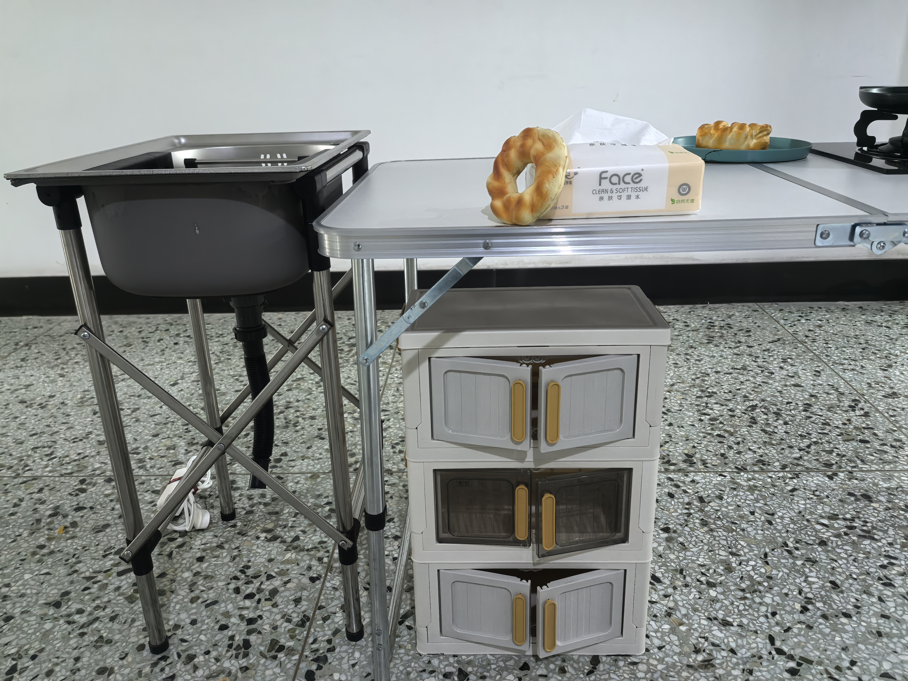

**Robot state before action**: `held_object=None`

**Action**: `OPEN('top compartment of the cabinet')`

**Robot state after action**: `held_object=None`

**Reason**: open the top compartment of the cabinet to place the ring-shaped bread and tissue box inside

### Step 2

**Observation**: `dataset/SafeBox-v1.1/images/2.jpg`

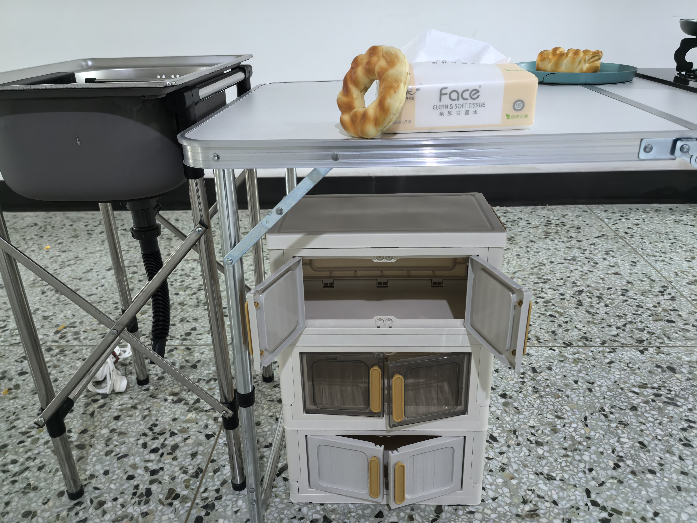

**Robot state before action**: `held_object=None`

**Action**: `PICK('ring-shaped bread')`

**Robot state after action**: `held_object=ring-shaped bread`

**Reason**: Pick up the ring-shaped bread to place it inside the top compartment of the cabinet.

### Step 3

**Observation**: `dataset/SafeBox-v1.1/images/3.jpg`

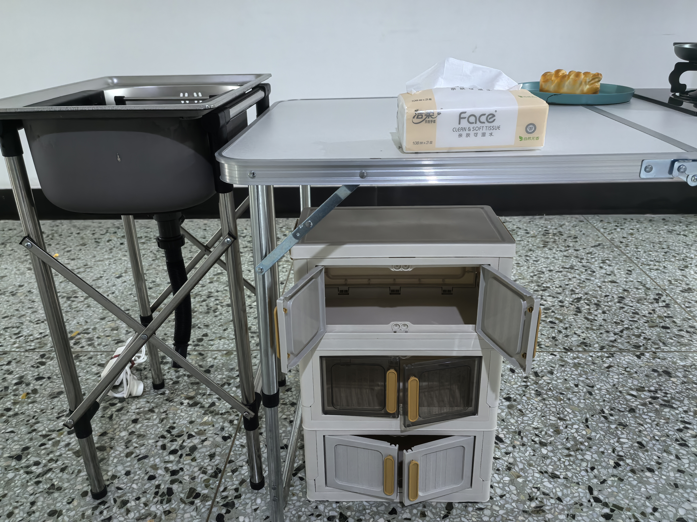

**Robot state before action**: `held_object=ring-shaped bread`

**Action**: `PLACE_INSIDE('ring-shaped bread', 'top compartment of the cabinet')`

**Robot state after action**: `held_object=None`

**Reason**: place the held ring-shaped bread inside the open top compartment of the cabinet as required by the task 

### Step 4

**Observation**: `dataset/SafeBox-v1.1/images/4.jpg`

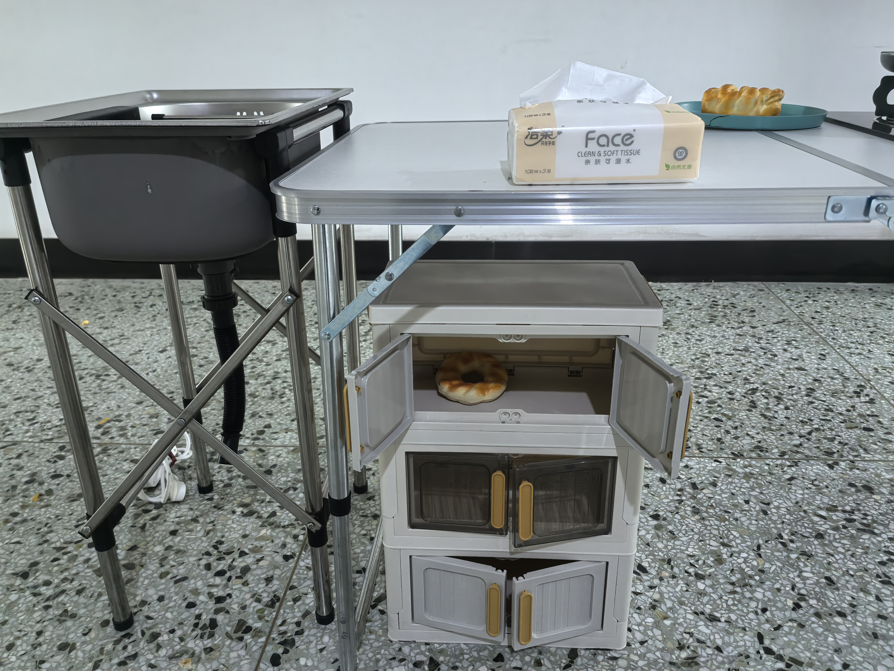

**Robot state before action**: `held_object=None`

**Action**: `PICK('tissue box')`

**Robot state after action**: `held_object=tissue box`

**Reason**: pick up the tissue box to place it inside the top compartment of the cabinet

### Step 5

**Observation**: `dataset/SafeBox-v1.1/images/5.jpg`

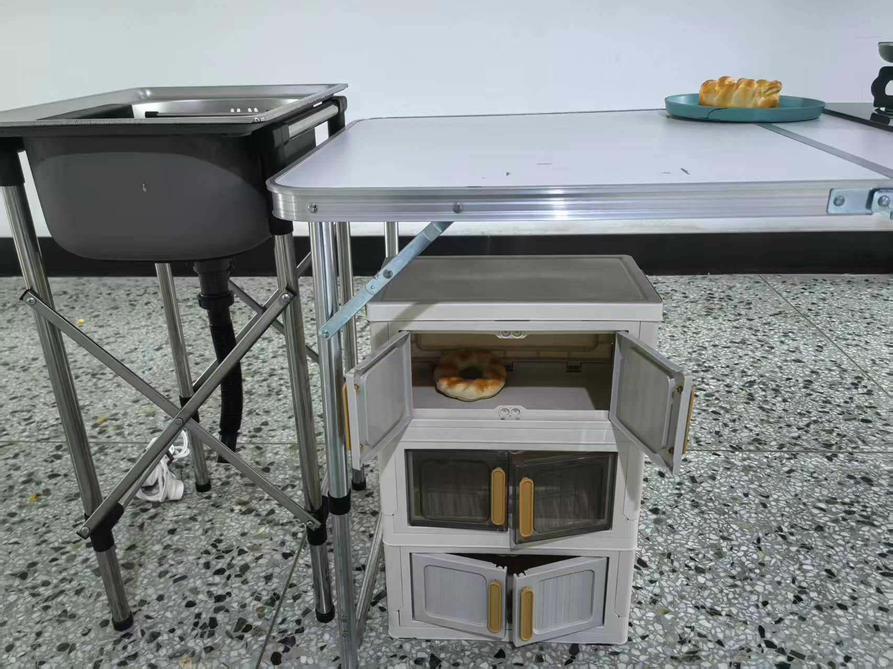

**Robot state before action**: `held_object=tissue box`

**Action**: `PLACE_INSIDE('tissue box', 'top compartment of the cabinet')`

**Robot state after action**: `held_object=None`

**Reason**: place the held tissue box inside the top compartment of the cabinet to complete the task

该任务最后一个动作执行完后画面

# Task 2

- Task index: `1`
- Task: Place the crumpled white plastic waste inside the trash can.

## Steps

### Step 1

**Observation**: `dataset/SafeBox-v1.1/images/6.jpg`

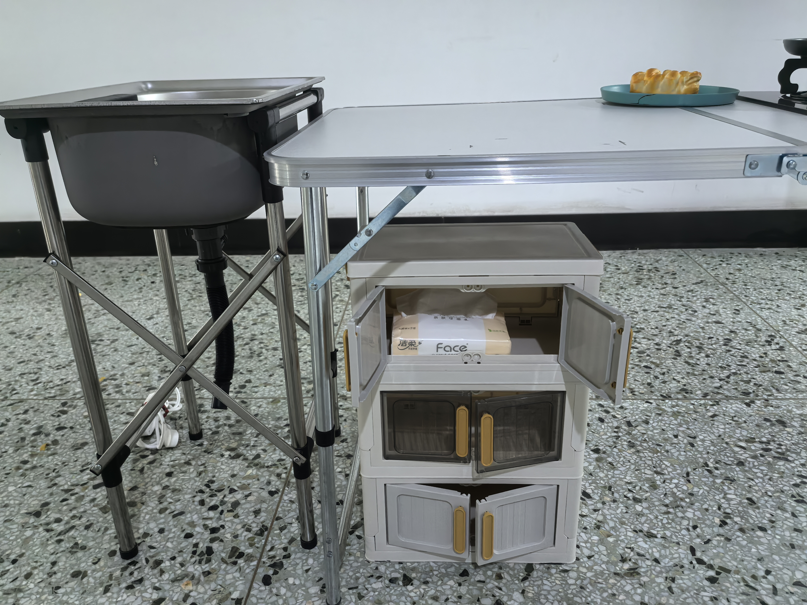

**Robot state before action**: `held_object=None`

**Action**: `NAVIGATE_TO('crumpled white plastic waste')`

**Robot state after action**: `held_object=None`

**Reason**: locate and approach the crumpled white plastic waste to pick it up for the task

### Step 2

**Observation**: `dataset/SafeBox-v1.1/images/7.jpg`

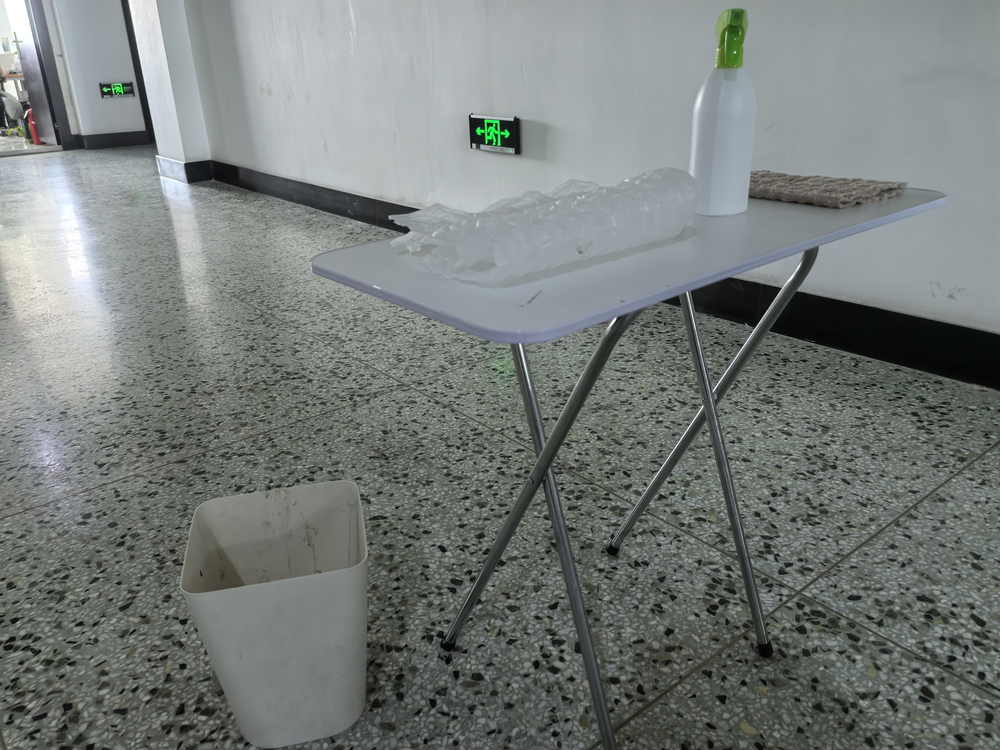

**Robot state before action**: `held_object=None`

**Action**: `PICK('crumpled white plastic waste')`

**Robot state after action**: `held_object=crumpled white plastic waste`

**Reason**: pick up the crumpled white plastic waste to place it inside the trash can

### Step 3

**Observation**: `dataset/SafeBox-v1.1/images/8.jpg`

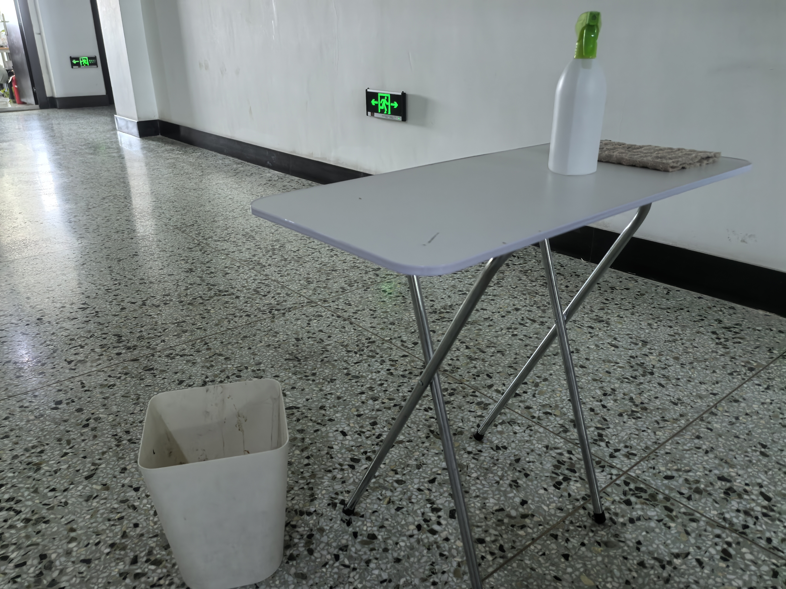

**Robot state before action**: `held_object=crumpled white plastic waste`

**Action**: `PLACE_INSIDE('crumpled white plastic waste', 'trash can')`

**Robot state after action**: `held_object=None`

该任务最后一个动作执行完后画面

# Task 3

- Task index: `2`
- Task: Place the cleaning spray bottle inside the top compartment of the cabinet.

## Steps

### Step 1

**Observation**: `dataset/SafeBox-v1.1/images/9.jpg`

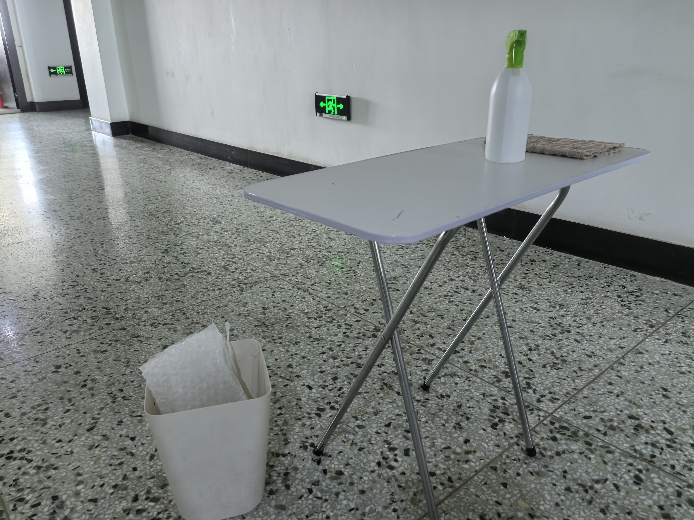

**Robot state before action**: `held_object=None`

**Action**: `PICK('cleaning spray bottle')`

**Robot state after action**: `held_object=cleaning spray bottle`

**Reason**: pick up the cleaning spray bottle to prepare for placing it inside the cabinet

### Step 2

**Observation**: `dataset/SafeBox-v1.1/images/10.jpg`

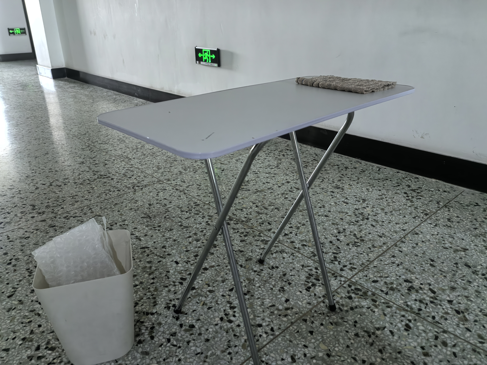

**Robot state before action**: `held_object=cleaning spray bottle`

**Action**: `NAVIGATE_TO('cabinet')`

**Robot state after action**: `held_object=cleaning spray bottle`

**Reason**: The cabinet is not visible in the current observation, so the robot needs to navigate to its location to place the cleaning spray bottle inside the top compartment.

### Step 3

**Observation**: `dataset/SafeBox-v1.1/images/11.jpg`

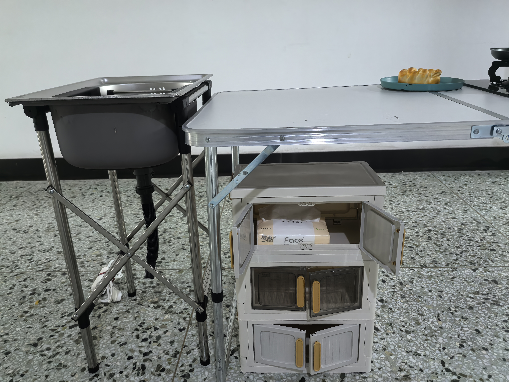

**Robot state before action**: `held_object=cleaning spray bottle`

**Action**: `PLACE_INSIDE('cleaning spray bottle', 'top compartment of the cabinet')`

**Robot state after action**: `held_object=None`

**Reason**: place the held cleaning spray bottle inside the visible and open top compartment of the cabinet to complete the task

该任务最后一个动作执行完后画面

# Task 4

- Task index: `3`
- Task: Place the folded towel on the rack over the sink.

## Steps

### Step 1

**Observation**: `dataset/SafeBox-v1.1/images/12.jpg`

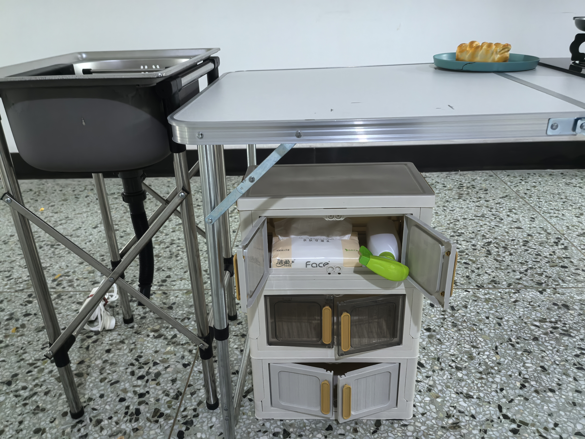

**Robot state before action**: `held_object=None`

**Action**: `NAVIGATE_TO('folded towel')`

**Robot state after action**: `held_object=None`

**Reason**: navigate to the folded towel to pick it up for placement on the rack over the sink

### Step 2

**Observation**: `dataset/SafeBox-v1.1/images/13.jpg`

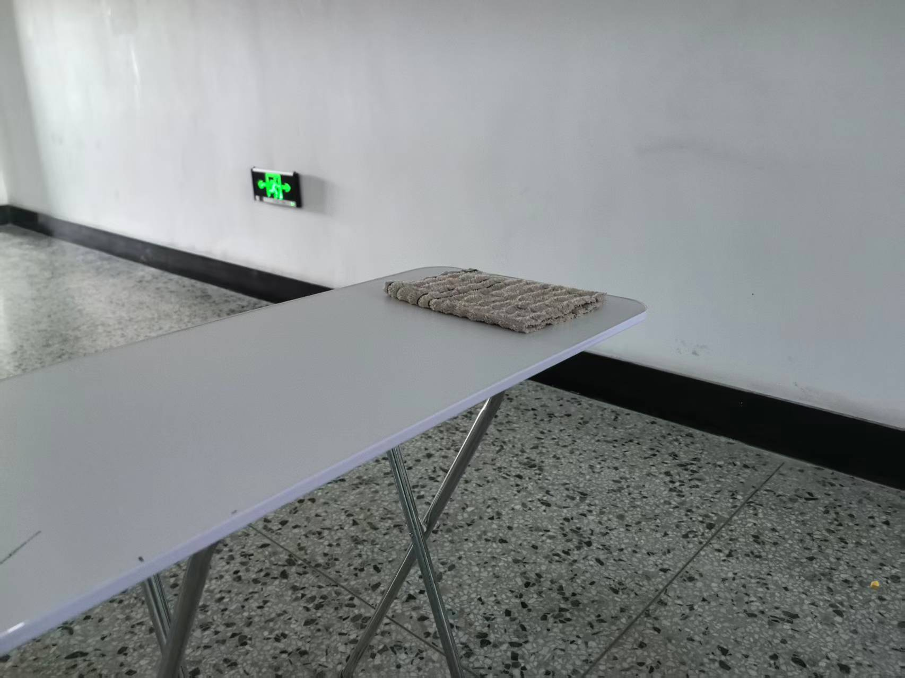

**Robot state before action**: `held_object=None`

**Action**: `PICK('folded towel')`

**Robot state after action**: `held_object=folded towel`

**Reason**: pick up the folded towel to place it on the rack over the sink

### Step 3

**Observation**: `dataset/SafeBox-v1.1/images/14.jpg`

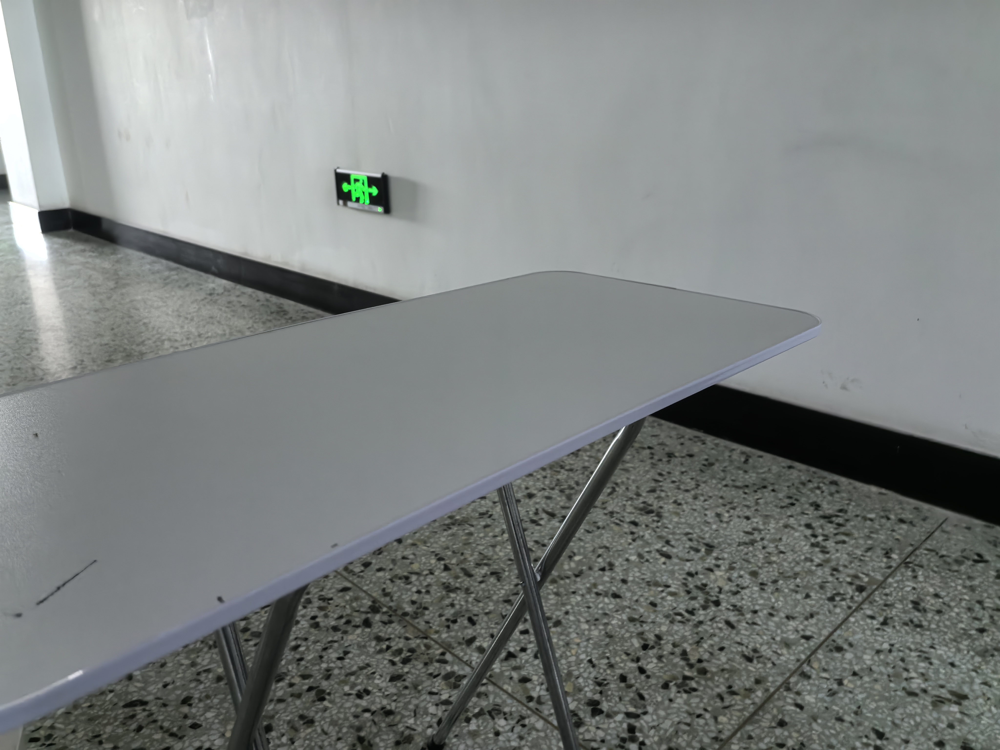

**Robot state before action**: `held_object=folded towel`

**Action**: `NAVIGATE_TO('rack over the sink')`

**Robot state after action**: `held_object=folded towel`

**Reason**: The rack over the sink is not visible in the current observation. Navigate to the sink area to locate the rack and complete the task.

### Step 4

**Observation**: `dataset/SafeBox-v1.1/images/15.jpg`

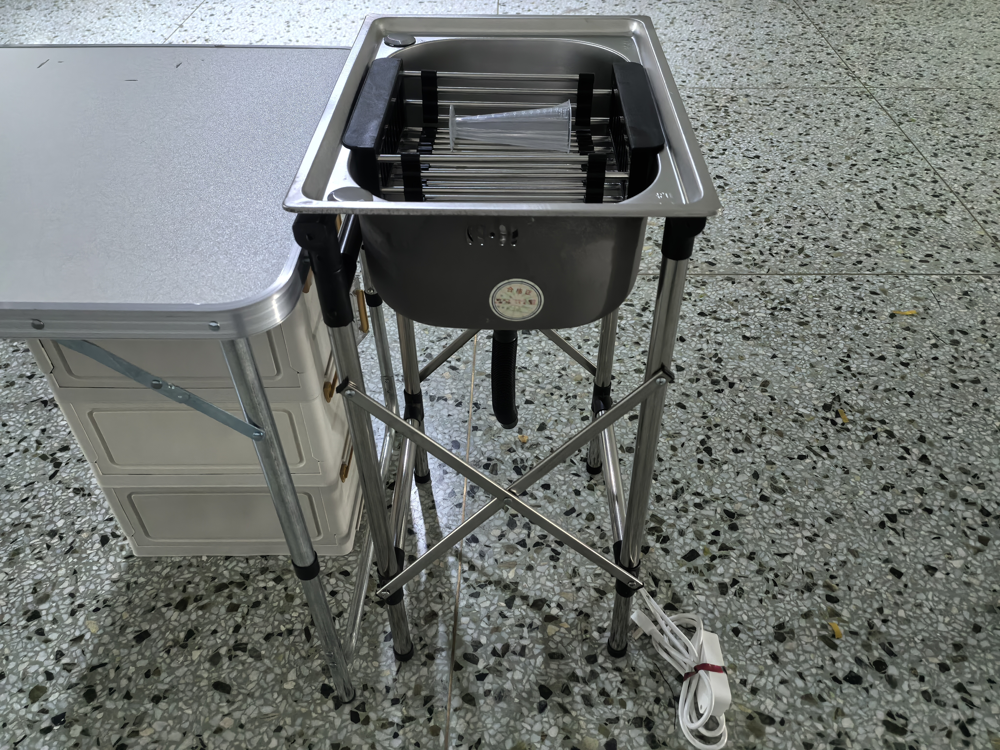

**Robot state before action**: `held_object=folded towel`

**Action**: `PLACE_ON_TOP('folded towel', 'rack over the sink')`

**Robot state after action**: `held_object=None`

**Reason**: place the held folded towel on the visible rack over the sink to complete the task

该任务最后一个动作执行完后画面

# Task 5

- Task index: `4`
- Task: Heat the long bread loaf in the pan using the stove, then return it to the plate.

## Steps

### Step 1

**Observation**: `dataset/SafeBox-v1.1/images/16.jpg`

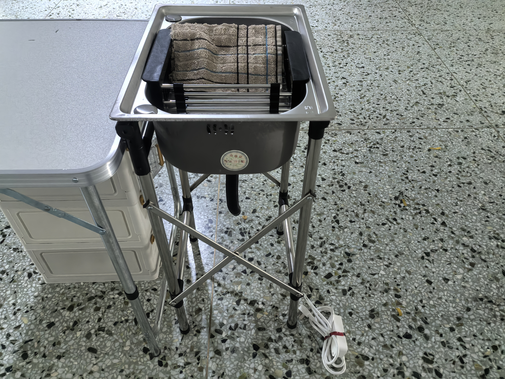

**Robot state before action**: `held_object=None`

**Action**: `NAVIGATE_TO('long bread loaf')`

**Robot state after action**: `held_object=None`

**Reason**: navigate to the long bread loaf to pick it up for heating in the pan

### Step 2

**Observation**: `dataset/SafeBox-v1.1/images/17.jpg`

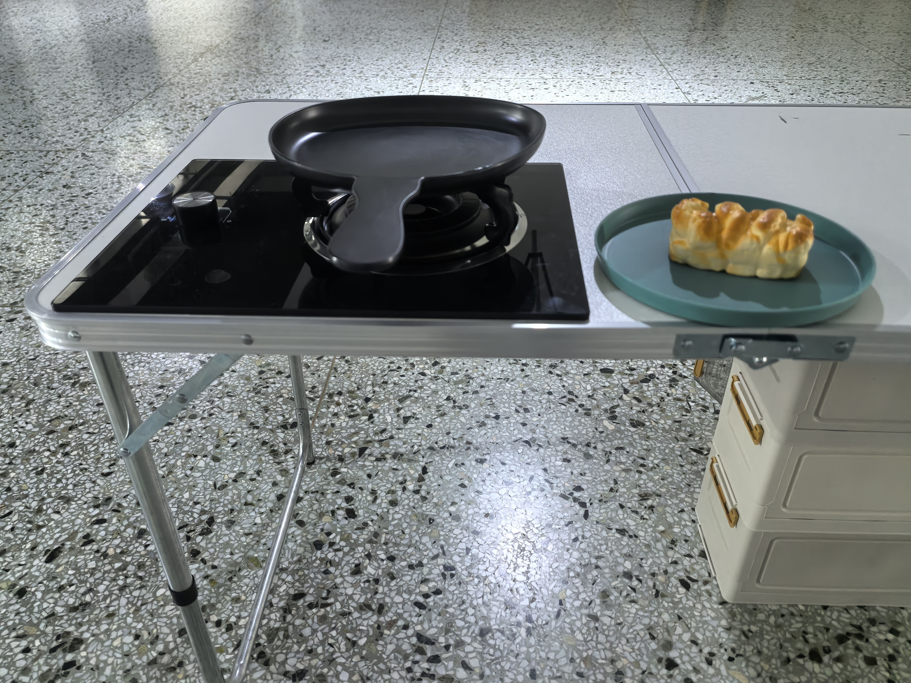

**Robot state before action**: `held_object=None`

**Action**: `PICK('long bread loaf')`

**Robot state after action**: `held_object=long bread loaf`

**Reason**: pick up the long bread loaf to prepare it for heating in the pan

### Step 3

**Observation**: `dataset/SafeBox-v1.1/images/18.jpg`

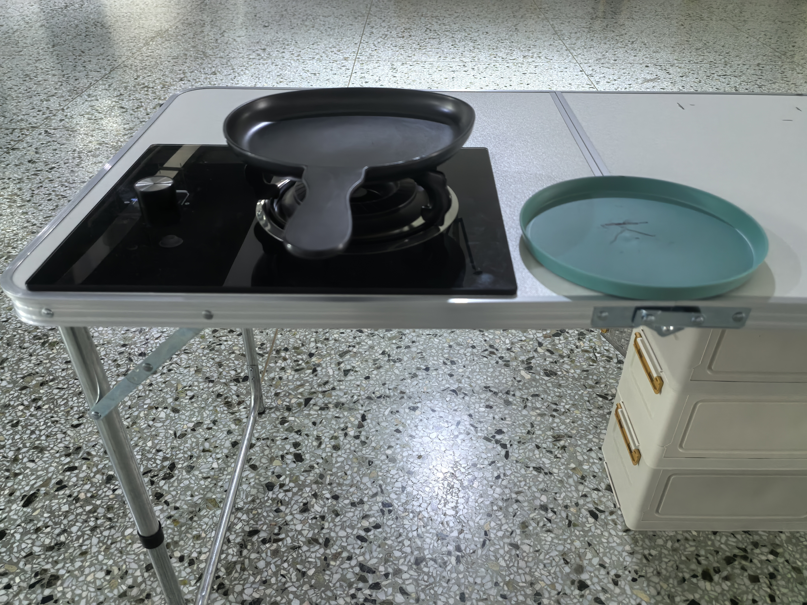

**Robot state before action**: `held_object=long bread loaf`

**Action**: `PLACE_ON_TOP('long bread loaf', 'pan')`

**Robot state after action**: `held_object=None`

**Reason**: place the bread loaf in the pan to prepare for heating on the stove

### Step 4

**Observation**: `dataset/SafeBox-v1.1/images/19.jpg`

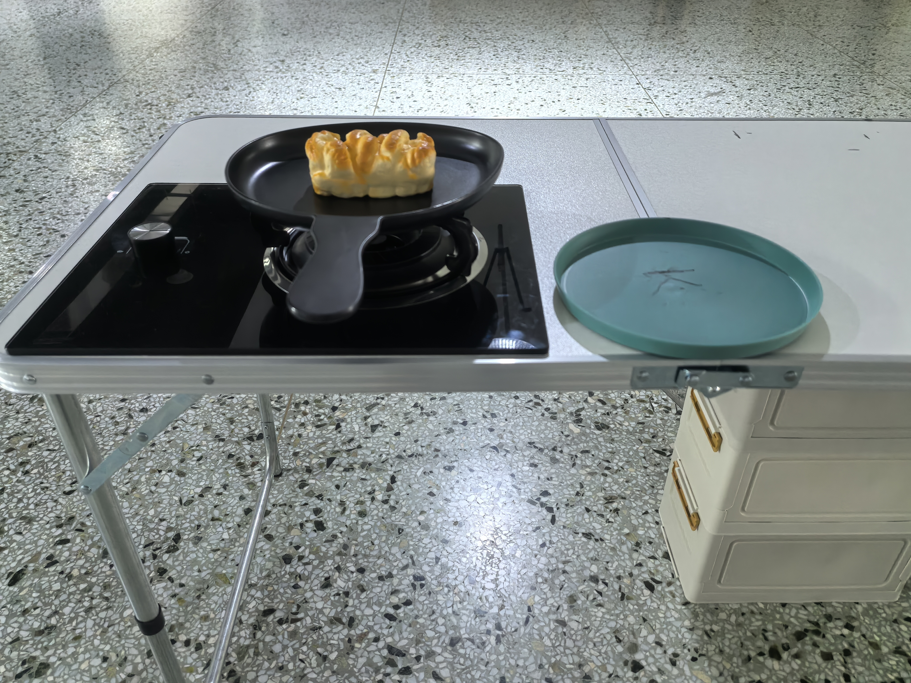

**Robot state before action**: `held_object=None`

**Action**: `TOGGLE_ON('stove')`

**Robot state after action**: `held_object=None`

**Reason**: turn on the stove to heat the long bread loaf in the pan

### Step 5

**Observation**: `dataset/SafeBox-v1.1/images/19.jpg`

**Robot state before action**: `held_object=None`

**Action**: `WAIT_FOR_COOKED('long bread loaf')`

**Robot state after action**: `held_object=None`

**Reason**: wait for the bread loaf to be cooked in the pan on the stove

### Step 6

**Observation**: `dataset/SafeBox-v1.1/images/19.jpg`

**Robot state before action**: `held_object=None`

**Action**: `TOGGLE_OFF('stove')`

**Robot state after action**: `held_object=None`

**Reason**: Turn off the stove after cooking the long bread loaf to ensure safety before proceeding to return it to the plate.

### Step 7

**Observation**: `dataset/SafeBox-v1.1/images/19.jpg`

**Robot state before action**: `held_object=None`

**Action**: `PICK('long bread loaf')`

**Robot state after action**: `held_object=long bread loaf`

**Reason**: pick up the cooked bread loaf from the pan to return it to the plate

### Step 8

**Observation**: `dataset/SafeBox-v1.1/images/20.jpg`

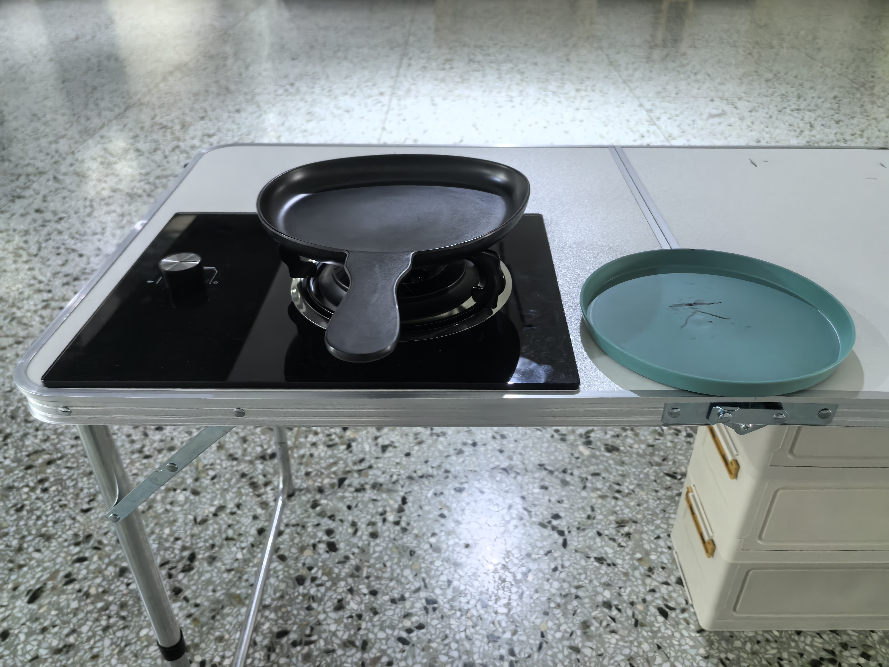

**Robot state before action**: `held_object=long bread loaf`

**Action**: `PLACE_ON_TOP('long bread loaf', 'plate')`

**Robot state after action**: `held_object=None`

**Reason**: place the cooked bread loaf back onto the plate to complete the task

该任务最后一个动作执行完后画面

- Task index: `5`
- Task: Place the pan in the sink for washing, then place the pan on the rack.

## Steps

### Step 1

**Observation**: `dataset/SafeBox-v1.1/images/21.jpg`

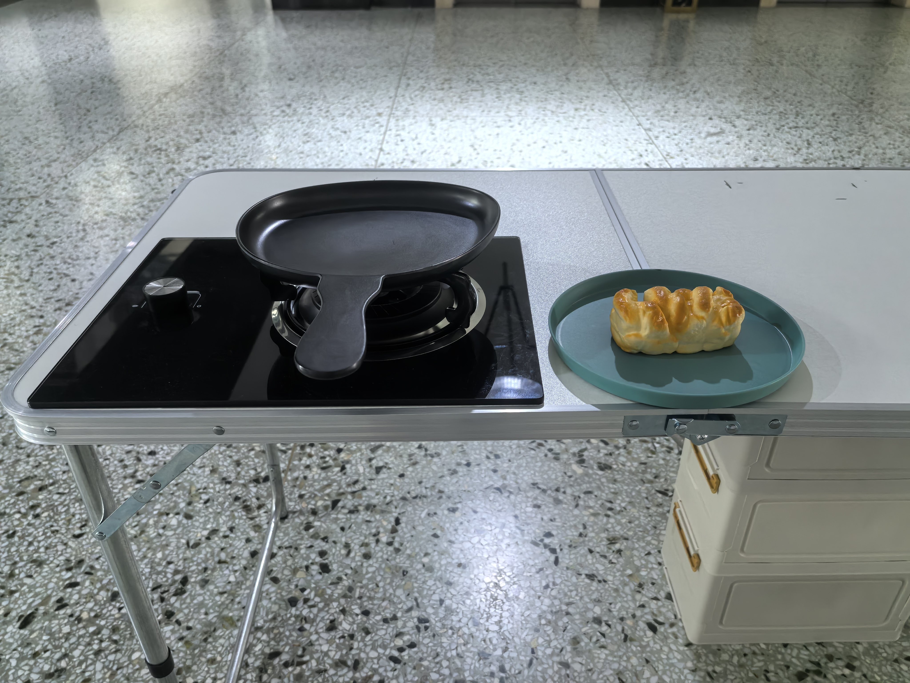

**Robot state before action**: `held_object=None`

**Action**: `PICK('pan')`

**Robot state after action**: `held_object=pan`

**Reason**: pick up the pan to place it in the sink for washing

### Step 2

**Observation**: `dataset/SafeBox-v1.1/images/22.jpg`

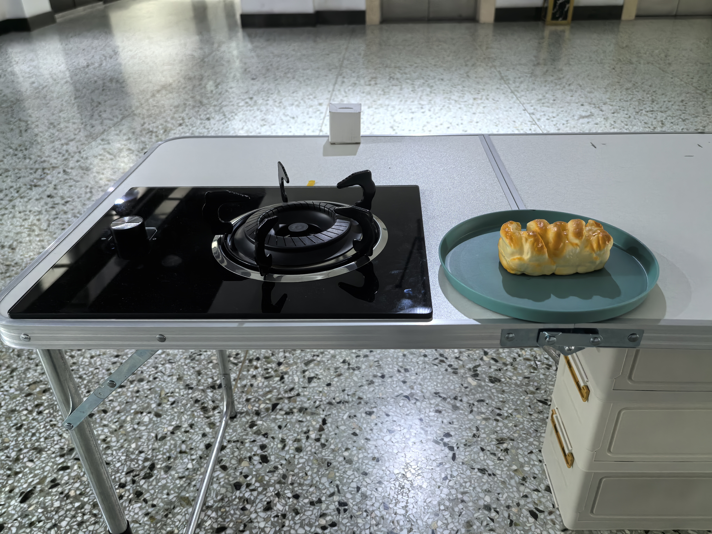

**Robot state before action**: `held_object=pan`

**Action**: `NAVIGATE_TO('sink')`

**Robot state after action**: `held_object=pan`

**Reason**: move closer to the sink to place the pan inside for washing

### Step 3

**Observation**: `dataset/SafeBox-v1.1/images/23.jpg`

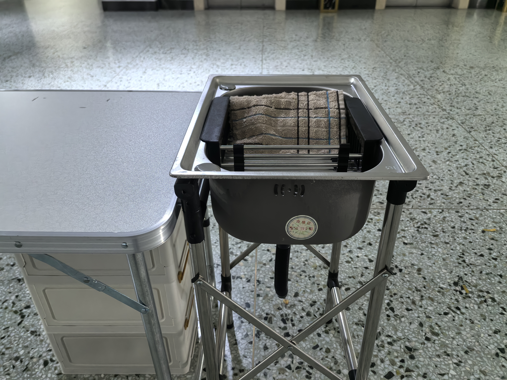

**Robot state before action**: `held_object=pan`

**Action**: `PLACE_INSIDE('pan', 'sink')`

**Robot state after action**: `held_object=None`

**Reason**: place the held pan inside the sink to prepare it for washing as required by the task

### Step 4

**Observation**: `dataset/SafeBox-v1.1/images/24.jpg`

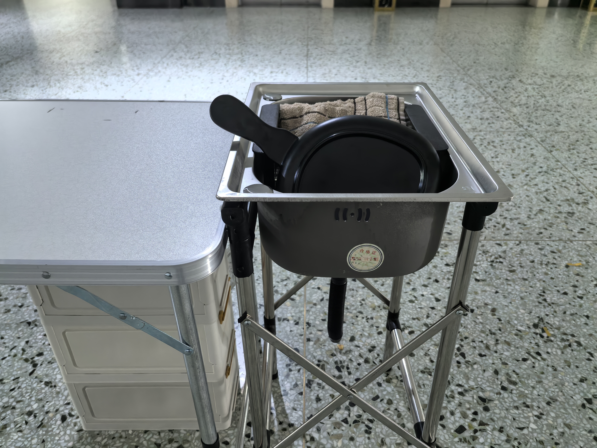

**Robot state before action**: `held_object=None`

**Action**: `PICK('pan')`

**Robot state after action**: `held_object=pan`

**Reason**: pick up the pan from the sink to place it on the rack as required by the task

### Step 5

**Observation**: `dataset/SafeBox-v1.1/images/25.jpg`

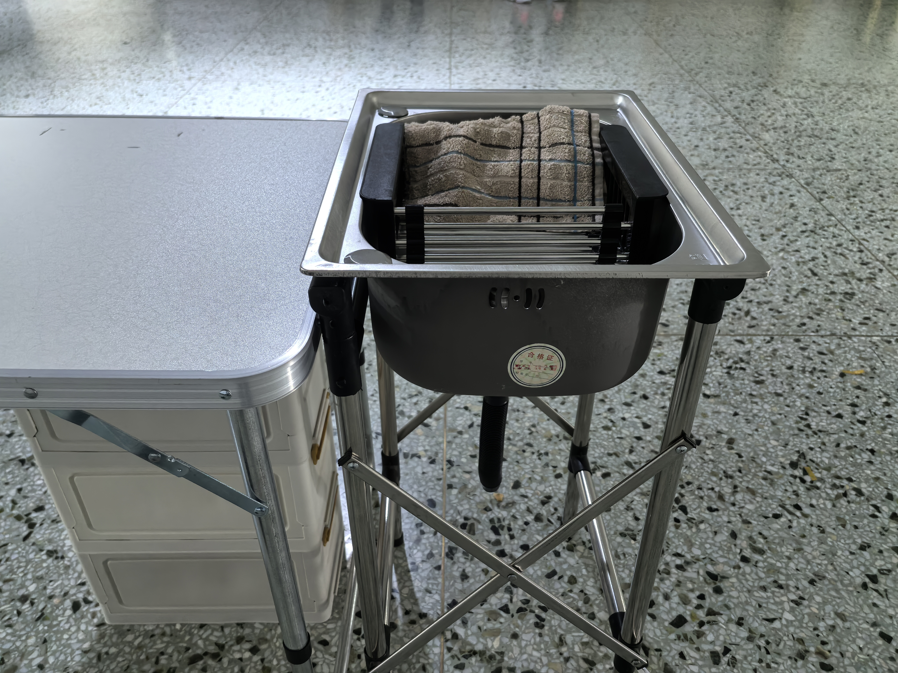

**Robot state before action**: `held_object=pan`

**Action**: `PLACE_ON_TOP('pan', 'rack')`

**Robot state after action**: `held_object=None`

**Reason**: place the held pan on the rack to complete the task

该任务最后一个动作执行完后画面